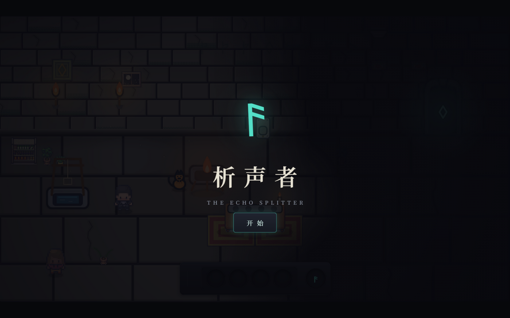
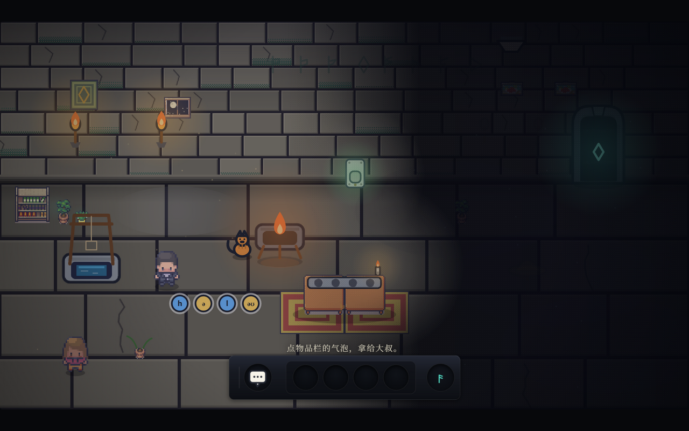

<div align="center">

# 析声者 · The Echo Splitter

**一间只能用耳朵走的石室。**
不背、不译、不考——把「听得出声音」还给每一个学过音标的人。

<sub>回响 · 48H 青年创造营 2026（杭州）｜赛道一 Echo｜未来 · 回响｜落地形式：游戏 Demo</sub>

[](https://github.com/AmbitionSight/TheEchoSplitter/actions/workflows/test.yml)
[](https://nodejs.org/)
[](#技术实现)
[](#三章)
[](https://github.com/AmbitionSight/TheEchoSplitter/releases/download/v2.0/demo.mp4)
[](LICENSE)



</div>

---

## 演示

▶ **[观看演示视频（4 分 16 秒 · 1080p60）](https://github.com/AmbitionSight/TheEchoSplitter/releases/download/v2.0/demo.mp4)** —— 三章连播：石室听音开门 → 裂谷跨崖 → 暗河拼筏。

视频约 50 MB，托管在 [Releases](https://github.com/AmbitionSight/TheEchoSplitter/releases) 而不是仓库内，所以 `git clone` 不会连带下载这 50 MB。GitHub 的 Markdown 不内嵌播放仓库外的 mp4，点击即下载观看。

## 这是什么

析声者是一个**零依赖的浏览器英语音素解谜游戏**。没有英文字幕，没有中文翻译：你在一间石室里碰触物件，声音会掉出来、结成石头；把石头搬上合成台拼回一个词，词就变成一件道具，交还给世界——门会开，苗会开花，河会载你走。

一套规则贯穿全部三章：**碰 → 捡 → 拼 → 用。**

> 语言的最小单位不是单词，是音素。
> 析声者按第一性原理教英语：回到 48 个声音本身。像婴儿一样泡在声音里，自己发现规律。

## 为什么做

学生在课堂上背过 48 个音标符号，耳朵却仍是「哑」的：认识 `open` 这个词，听不出它里面有两声。市面上的产品都在**考**耳朵——选择题、跟读打分，把评判交给机器。

析声者反过来：**把判断交还给玩家自己**。这不是又一张音标表，而是一个必须用耳朵才能通关的世界。

- **给谁玩**：在课堂学过音标、会认符号却听不出声的中小学生；想把发音从头重学的成年人；想感受「把声音拆开」的玩家。
- **不给什么**：不给分数、不给红叉、不给翻译、不用麦克风。

## 怎么玩

| 步 | 动作 | 发生了什么 |
|---|---|---|
| **碰** | 走近物件按 <kbd>E</kbd>（或点它） | 声音掉出来，结成音素石 |
| **捡** | 走近石头按 <kbd>E</kbd> | 石头进物品栏（金=元音，蓝=辅音，各有一枚符文） |
| **拼** | 把石头拖进合成槽 | 拼对一个词，它变成一件词具 |
| **用** | 把词具拖向世界（或对自己按 <kbd>E</kbd>） | 世界回应你 |

<div align="center">


<br><i>捡起声音，结成石头——金色是元音，蓝色是辅音</i>

</div>

- **输入**：键盘（方向键/AD 走、<kbd>空格</kbd> 跳、<kbd>E</kbd> 交互）或**纯鼠标 / 触屏**（点哪走哪、点目标自动交互、右下角跳跃键）。
- **听**：每个声音都能点读；碰过的回声物会点亮《析声录》里的符文，一路攒进书档。

## 三章

| 章 | 场景 | 教什么（可拼词） | 动作 |
|---|---|---|---|
| **第一章 · 石室** | 俯视石室，三幕剧（听 / 做 / 得） | `hello` · `open` | 碰、点亮、开门 |
| **第二章 · 裂谷 → 崖壁** | 侧视峡谷，同页无缝两幕 | `jump` · `rope` | 跨越、攀爬 |
| **第三章 · 暗河** | 侧视河程，三间房 | `log` · `rope` · `raft` · `pole` | 拼装、行筏 |

48 音素符文体系全量在册（《析声录》）；词表当前覆盖其中 15 个音素，其余章节持续铺开。

## 快速开始

需要 **Node 18+**，不安装任何依赖，克隆即玩。建议 Chrome / Edge。

```bash
npm start             # 启动：http://localhost:3000
PORT=3002 npm start   # 换端口
npm test              # 全部自动化测试（node --test）
```

浏览器打开：

- `/` —— 第一章（石室）
- `/chapter2.html` —— 第二章（走到走廊尽头会**无缝**进入崖壁后半段）
- `/chapter3.html` —— 第三章（暗河）

## 调试

| 钩子 | 用途 |
|---|---|
| `?autostart=1` | 跳过标题与序章，直接开始 |
| `?autostart=1&beat=<拍名>` | 直达任意教学拍（如 `bench` / `craft` / `door-open`） |
| `window.G` | 当前章节的内容、游戏状态与 `G.jump(拍名)` |
| `window.__errors` | 运行期错误数组（为空即无错） |

运行期任何报错也会**直接显示在页面顶部**（红底白字），不必开控制台。

## 项目结构

```
server.js            零依赖 HTTP 服务：public/ 静态分发 + /api/chapterN 内容接口
content/             章节数据（词表、音素、台词、几何、提示）—— 内容与代码分离
public/
├─ index.html / chapter2.html / chapter2b.html / chapter3.html   四个页面入口
├─ css/style.css     全站样式（石板材质体系）
├─ js/
│  ├─ shell.js       共享壳：装配章节、语音/音效、物品栏、指令解释器、主循环、结算
│  ├─ chapter.js     全章共享的事件机核心与 kit 公共行为
│  ├─ hotbar.js / workbench.js / journal.js   物品栏 / 合成台 / 析声录
│  ├─ sideview.js / actors.js / art.js / sprites.js / audio.js / ui.js / profile.js
│  ├─ ch1/           第一章按层拆分：planners · physics · render · event · kit
│  ├─ ch2.js / ch2b.js   第二章两幕（裂谷 / 崖壁）
│  └─ ch3/           第三章按层拆分：event · render · kit · cave
└─ assets/           像素素材与图集
test/                330 项自动化测试（node:test）
docs/                CONTRIBUTING.md（分支模型与提交约定）与 README 截图
.github/             CI 工作流、Issue / PR 模板与社区健康文件
```

## 技术实现

- **零依赖、零构建**：Node 内置 `http` + 原生 ES Modules + Canvas 2D + DOM/CSS + Web Speech + WebAudio。没有 `node_modules`，不存在环境漂移。
- **分层模块**：每章 = 纯事件机（Node 可测）+ 浏览器 kit（世界/输入/绘制）。层与层单向依赖（`planners ← physics/render ← kit`），事件机只依赖共享模块。
- **共享壳**：`shell.js` 一份运行时服务全部章节——内容装载、语音队列、物品栏、指令解释器、主循环、结算与存档。
- **内容与代码分离**：所有文案、词表、时长、提示都在 `content/*.json`，客户端经 `/api/chapterN` 取用。
- **游戏逻辑全在前端**：服务端只做静态分发与内容装载，教室局域网内离线可跑。

## 测试

```bash
npm test                              # 全部（当前 330 项）
node --test test/ch2.test.js          # 单文件
node --test test/ch2.test.js test/ch3.test.js   # 多文件
```

覆盖：事件机状态推进、物品栏与合成、门与仪式、横版物理与碰撞、内容不变式（无 emoji / 无红字）、书档持久化、语音兜底、精灵元数据、服务器路由与静态分发。

> 画布渲染与真机手感由浏览器冒烟覆盖；Node 测试覆盖可导入的逻辑。
