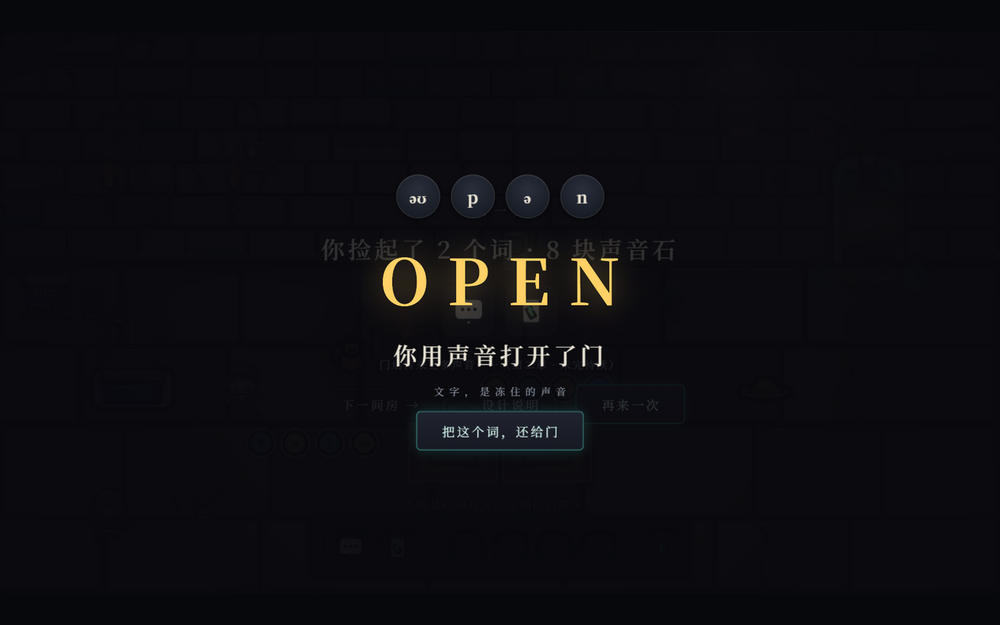

<div align="center">

# 析声者 · The Echo Splitter

**回响 · 48H 青年创造营 2026（杭州）** ｜ 赛道一 Echo｜未来·回响 ｜ 落地形式：游戏 Demo

[](https://hks.zj-qq.cn/)[](#)[](#)[](#)[](#)


**一间只能用耳朵走的石室：不背、不译、不考，把"听得出声音"还给每一个学过音标的人。**

> 语言的最小单位不是单词，是音素。
>
> 析声者按第一性原理教英语：回到 48 个声音本身。像婴儿一样泡在声音里，自己发现规律。

## 痛点：会认音标，听不出声

学生在课堂上背过 48 个音标符号，耳朵却仍是"哑"的：认识 open 这个词，听不出它里面有两声。市面上的产品都在"考"耳朵——选择题、跟读打分，把评判交给了机器。析声者反过来，把判断交还给玩家自己：这不是又一张音标表，而是一个必须用耳朵才能通关的世界。

**给谁玩**：在课堂学过音标、会认符号却听不出声的中小学生；想把发音从头重学的成年人；想感受"把声音拆开"的玩家。

## 这是什么游戏

没有英文字幕，没有中文翻译。碰一碰屋里的东西，声音会掉出来，结成石头。捡起来，搬到合成台上，把几块石头拼成一个词，词就变成一件道具：拼出 open 的声音，就能把这句话说给门听，门会开。

一套规则贯穿全部三章：**碰，捡，拼，用。**

<div align="center">

<i>捡起声音，结成石头——金色是元音，蓝色是辅音</i>


<i>拼出 open 的声音，把这个词说给门听</i>

## 快速开始

需要 Node 18 或更新版本，不用安装任何依赖。建议使用 Chrome / Edge。

```bash
npm start             # http://localhost:3000
PORT=3002 npm start   # 换端口
npm test              # 全部自动化测试（node --test）
```

- 浏览器打开：`/` 是第一章，`/chapter2.html` 是第二章（走到走廊尽头会无缝进入崖壁后半段），`/chapter3.html` 是第三章。
- 评审快速通道：第一章网址加 `?autostart=1&beat=<段名>`，可直达任意教学拍——
  `bench`（合成台）、`craft`（拼词）、`door-open`（开门），三分钟走完核心闭环。

## 技术实现

- **分层模块架构**：事件机 / 规划器 / 物理 / 渲染各为一层，三个章节共享同一套规则引擎：

```
server.js        静态分发与内容装载（游戏逻辑全部在前端，教室局域网离线可跑）
public/js/
├─ shell.js      入口与章节装配（?autostart / ?beat 调试通道）
├─ ch1/          侧视章节：event 事件机 · planners 规划器 · physics 物理 · render 渲染
├─ ch2 / ch2b / ch3/   三章（第二章含崖壁后半段），复用同一套事件机与 kit
└─ audio / workbench / journal …   语音队列、合成台、析声录
content/         三章词表与关卡数据（JSON）
test/            模块级单测 + 端到端关卡测试
```

- **全量自动化测试**：`npm test` 覆盖玩法规则、内容数据、物理与服务器。
- **零依赖**：没有任何 npm 包，克隆即玩，不存在环境漂移。
- 更多设计文档：[DESIGN.md](DESIGN.md) · [PRODUCT.md](PRODUCT.md) · [贡献与分支约定](docs/CONTRIBUTING.md)
